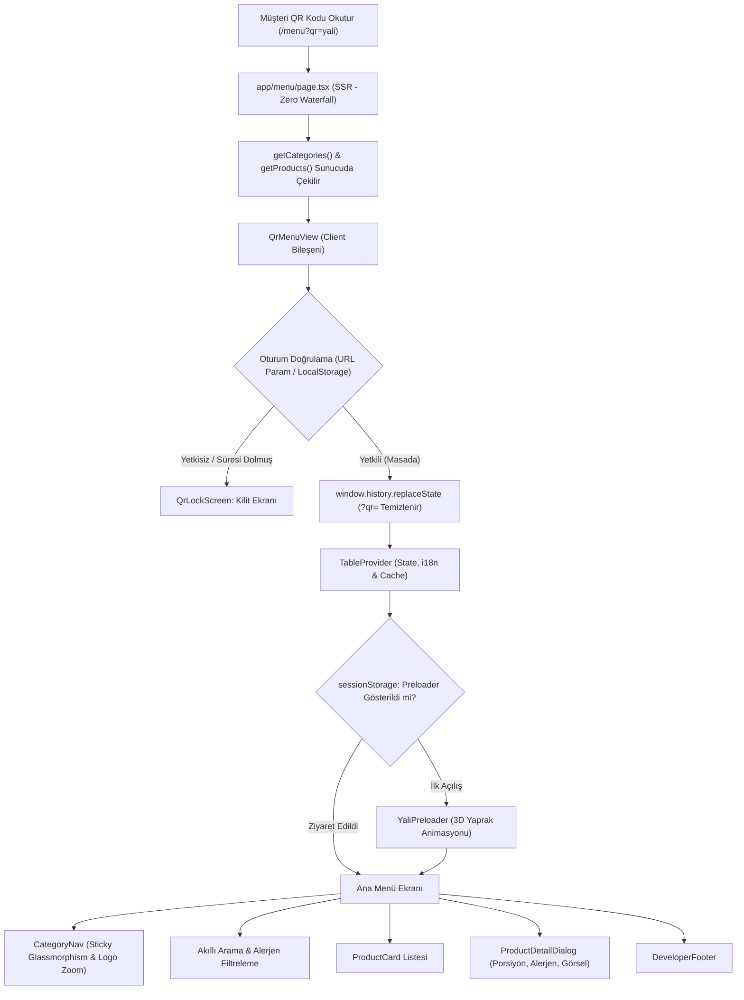

# 🍽️ Yalı Restaurant — Yeni Nesil QR Menü & Restoran Yönetim Sistemi

<div align="center">


**Yalı Restaurant için özel olarak geliştirilmiş; mobil uygulama akıcılığında (PWA), sıfır gecikme (Zero-Lag), 4 kademeli hibrit veri mimarisine ve 300 DPI matbaa hazır masa kartı baskı motoruna sahip kurumsal dijital QR menü ve operasyon yönetim platformu.**

[Canlı Menüyü İncele](#-hızlı-başlangıç) • [Özellikler](#-öne-çıkan-özellikler) • [Mimari](#-sistem-mimarisi--müşteri-akışı) • [Şube Uyarlama](#-yeni-bir-şubeye-uyarlama-multi-branch)

</div>

---

## 🌟 Öne Çıkan Özellikler

### 📱 1. Müşteri QR Menü Deneyimi (Zero-Lag & PWA)
* **Akıcı Mobil Deneyim:** Next.js 16 Server Components ve React 19 mimarisi ile ilk boyama (First Contentful Paint) anında gerçekleşir; boş beyaz ekran veya dönen çarklar olmadan menü anında yüklenir.
* **Özel 3D Yaprak Preloader:** Marka prestijini artıran açılış animasyonu; `sessionStorage` ile akıllıca yönetilir, sayfa yenilemelerinde müşteriyi sıkmamak için tekrar tekrar oynamaz (menü altındaki butondan istenirse tekrar tetiklenebilir).
* **Sticky Glassmorphism Navigasyon:** Kaydırma sırasında üstte sabitlenen yarı saydam bulanık (backdrop-blur) kategori çubuğu.
* **Logo Zoom Modal:** Navigasyon üzerindeki dairesel Yalı logosuna dokunulduğunda pürüzsüz yay fiziği (Spring Physics) ile ekran ortasında açılan etkileşimli logo pop-up'ı.
* **Çift Dilli Arama & Akıllı Rozet Filtresi:** Türkçe (TR) ve İngilizce (EN) dillerinde anlık harf harf arama. Alerjenler (Gluten, Laktoz vb.) ve akıllı etiketler (*"acı", "soğuk", "şef", "vegan"*) ile otomatik eşleşme.
* **Detaylı Ürün Pencereleri:** Yüksek çözünürlüklü fotoğraflar, tam porsiyon/gramaj bilgisi, alerjen ikazları ve şef tavsiyeleri.

---

### 🛡️ 2. Gelişmiş Güvenlik ve QR Oturum Döngüsü (Security Gate)
* **Masaya Özel Oturum Doğrulama:** Müşteri masadaki QR kodu okuttuğunda (`/menu?qr=yali`), istemciye 2 saatlik (7200 sn) zaman damgalı oturum çerezi ve `localStorage` kaydı verilir.
* **Clean URL (URL Temizleme):** Masada QR okunduktan hemen sonra `window.history.replaceState` ile URL'deki `?qr=yali` parametresi adres çubuğundan sessizce kaldırılır. Menü linki kopyalanıp harici birine atıldığında, geçerli oturumu olmayan cihazlar doğrudan şık bir **Kilit Ekranı (QrLockScreen)** ile karşılaşır.
* **Arama Motoru İzolasyonu:** Menü sayfaları meta etiketlerinde `noindex, nofollow` ile işaretlenerek menü fiyatlarının ve içeriklerinin Google arama sonuçlarına sızması engellenmiştir.

---

### ⚡ 3. 4 Kademeli Hibrit Veri & Kesintisiz Çalışma (Failover Mimarisi)
Sistem, internet kesintileri veya uzak veritabanı arızalarına karşı hiçbir zaman durmayacak şekilde 4 katmanlı kademeli önbellek ve veri mimarisiyle donatılmıştır:

```
[Müşteri İsteği: /menu]
         │
         ▼
[lib/data/menu-store.ts - getMenuStore()]
         │
         ├─► [0. Kademe: RAM Önbelleği (globalThis)] ────► 15 sn TTL ile veritabanına sorgu atılmadan anında döner
         │
         ├─► [1. Kademe: Upstash Redis (Vercel KV)] ─────► "yali_menu_data_v1" anahtarıyla bulut önbellek
         │
         ├─► [2. Kademe: Supabase PostgreSQL] ───────────► İlişkisel kategori ve ürün tabloları
         │
         └─► [3. Kademe: Yerel JSON (data/menu.json)] ───► İnternet veya harici servis yoksa %100 çevrimdışı garanti
```

---

### 👨‍🍳 4. Garson & Restoran Operasyon Paneli
* **Canlı Masa & Sipariş Yönetimi:** Masaların doluluk durumu, garson atamaları ve sipariş durum takibi.
* **Garson PIN Kilit Ekranı:** Hızlı ve güvenli erişim için dokunmatik ekranlara uygun nümerik PIN kilidi.
* **Anlık Garson Çağırma Entegrasyonu:** Müşteri menü üzerinden garson çağırdığında personel paneline anında düşen çağrı bildirimleri.
* **Kategori & Ürün Yönetim Modalları:** Fiyat güncellemeleri, ürün gizleme/gösterme ve yeni kategori ekleme panelleri.

---

### 🖨️ 5. 300 DPI Matbaa Hazır Masa QR Kartı Baskı Motoru
Restorandaki pleksi ve akrilik ayaklıklar için özel masa kartı basım aracı:
* **Standart Boyut:** 7.5 × 10 cm dikey masa kartı formatı.
* **Merkezi QR:** 5 × 5 cm yüksek kontrastlı, hatasız okunabilen QR kod alanı.
* **Vektörel Çıktı:** 300 DPI çözünürlükte, matbaada basıma hazır **PNG** ve **PDF** formatlarında tek tıkla dışa aktarma.

---

### 🧪 6. Test & Kod Sağlamlığı
* **Playwright E2E Testleri:** `e2e/menu.spec.ts` ve `e2e/login.spec.ts` ile uçtan uca otomatik testler (kilit ekranı doğrulaması, QR oturum akışı, kategori geçişleri).
* **Temiz Kod Tabanı:** ESLint ve TypeScript strict mod kurallarına tam uyumlu, optimize edilmiş Next.js derleme mimarisi.

---

## 🏗️ Sistem Mimarisi & Müşteri Akışı



---

## 📁 Proje Dizin Yapısı

```bash
yali-qr-menu/
├── app/                                 # Next.js 16 App Router Sayfaları
│   ├── (auth)/login/                   # Personel ve yetkili giriş sayfası
│   ├── (dashboard)/panel/              # Restoran yönetim ve operasyon paneli
│   ├── (public)/                       # Genel sayfalar ve karşılama
│   ├── api/                            # API Route uç noktaları (menü, sipariş, sağlık)
│   ├── menu/                           # Müşteri QR menü rotası (SSR + Client)
│   ├── globals.css                     # Tailwind v4 tema değişkenleri ve animasyonlar
│   └── layout.tsx                      # Kök HTML & font yapılandırması
├── components/
│   ├── menu/                           # Müşteri menü arayüz bileşenleri
│   │   ├── category-nav.tsx            # Sticky kategori menüsü
│   │   ├── developer-footer.tsx        # Geliştirici imzası ve sosyal linkler
│   │   ├── logo-zoom-modal.tsx         # Yay fiziği ile açılan logo pop-up'ı
│   │   ├── product-card.tsx            # Ürün listeleme kartı
│   │   ├── product-detail-dialog.tsx   # Zengin ürün detay modalı
│   │   ├── qr-lock-screen.tsx          # Yetkisiz giriş kilit ekranı
│   │   └── qr-menu-view.tsx            # Ana menü istemci orkestratörü
│   ├── dashboard/                      # Operasyon ve yönetim paneli bileşenleri
│   │   ├── table-qr-card-printer.tsx   # 300 DPI masa kartı baskı motoru
│   │   ├── waiter-pin-lock-modal.tsx   # Garson PIN kilidi
│   │   └── product-management-modal.tsx# Ürün ve kategori yönetim modalları
│   └── ui/                             # Tasarım sistemi temel bileşenleri
│       └── yali-preloader.tsx          # 3D yaprak açılış preloader'ı
├── data/
│   └── menu.json                       # 3. Kademe yerel JSON menü yedeği
├── e2e/                                # Playwright Uçtan Uca (E2E) Testleri
│   ├── menu.spec.ts                    # QR menü erişim ve akış testleri
│   └── login.spec.ts                   # Panel giriş ve PIN testleri
└── lib/
    ├── context/                        # React Context sağlayıcıları (Masa, Dil, Auth)
    ├── data/                           # 4 Kademeli veri erişim katmanı (menu-store.ts)
    └── security/                       # QR oturum ve çerez doğrulama motoru
```

---

## 🚀 Hızlı Başlangıç

### Gereksinimler
- Node.js 20+
- npm, yarn, pnpm veya bun

### 1. Projeyi Klonlayın ve Bağımlılıkları Yükleyin
```bash
git clone https://github.com/emrahsahn/yali-qr-menu.git
cd yali-qr-menu
npm install
```

### 2. Ortam Değişkenlerini Tanımlayın
`.env.example` dosyasını `.env.local` olarak kopyalayın:
```bash
cp .env.example .env.local
```

Gerekli değişkenleri düzenleyin:
```env
# Personel Paneli Giriş Bilgileri
STAFF_USERNAME=yali_yonetim
STAFF_PASSWORD=guclu_sifre_buraya
AUTH_SECRET=gizli_anahtar_buraya

# Opsiyonel: Uzak Veritabanı ve Redis (Tanımlanmazsa yerel JSON kullanılır)
# NEXT_PUBLIC_SUPABASE_URL=...
# NEXT_PUBLIC_SUPABASE_ANON_KEY=...
# UPSTASH_REDIS_REST_URL=...
# UPSTASH_REDIS_REST_TOKEN=...
```

### 3. Geliştirme Sunucusunu Başlatın
```bash
npm run dev
```
Tarayıcınızda açın:
* **QR Doğrulamalı Menü:** [http://localhost:3000/menu?qr=yali](http://localhost:3000/menu?qr=yali)
* **Kilit Ekranı Testi:** [http://localhost:3000/menu](http://localhost:3000/menu)
* **Yönetim Paneli:** [http://localhost:3000/panel](http://localhost:3000/panel)

---

## 🧪 Testleri Çalıştırma

Projeyi derlemek ve test paketini koşturmak için:

```bash
# Kod derleme ve TypeScript tip doğrulaması
npm run build

# ESLint statik kod analizi
npm run lint

# Playwright E2E testleri
npm run test:e2e
```

---

## 🏢 Yeni Bir Şubeye Uyarlama (Multi-Branch)

Sistemi yeni bir şube için klonlarken veya çoğaltırken izlenmesi gereken adımlar:

1. **Tarayıcı Depolama Anahtarları (Namespace):** Aynı tarayıcıda iki şubenin oturumlarının karışmaması için `lib/security/qr-session.ts`, `components/menu/qr-menu-view.tsx` ve `lib/context/table-context.tsx` içindeki depolama anahtarlarını yeni şube adına göre güncelleyin.
2. **Preloader Bileşeni:** `components/ui/` altındaki preloader dosyasında `sessionStorage` anahtarını yeni şubeye göre ayarlayın.
3. **Marka & Logolar:** `public/images/` altına yeni şube logosunu ekleyip `category-nav.tsx`, `logo-zoom-modal.tsx` ve `table-qr-card-printer.tsx` dosyalarındaki referansları güncelleyin.
4. **Masa Kartı Şablonu:** `table-qr-card-printer.tsx` dosyasında QR hedef URL'ini (`/menu?qr=yeni_sube`) tanımlayın.
5. **Menü & Ürünler:** `data/menu.json` dosyasını yeni şubenin ürünleri ve fiyatlarıyla doldurun.

---

## 💻 Geliştirici

Bu proje modern restoran teknolojileri ve yüksek kullanıcı deneyimi standartları gözetilerek geliştirilmiştir.

* **GitHub:** [@emrahsahn](https://github.com/emrahsahn)
* **LinkedIn:** [Emrah Şahin](https://www.linkedin.com/in/emrahsahn/)

---

## 📄 Lisans

Bu proje özel bir restoran menü ve operasyon yazılımıdır. Tüm hakları saklıdır.
